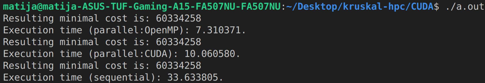

# kruskal-hpc
Parallelization project in C - How to make Kruskal's algorithm faster?

    

***
- run *kruskal.c* => gcc  kruskal.c -fopenmp -lm 
- run *qsort.cu* => nvcc qsort.cu -rdc=true -lcudadevrt -Xcompiler -fopenmp
- run *thrust.cu* => nvcc thrust.cu -rdc=true -lcudadevrt -Xcompiler -fopenmp
- run *kruskal.cu* => nvcc kruskal.cu -rdc=true -lcudadevrt -Xcompiler -fopenmp -lm
 

***

    

